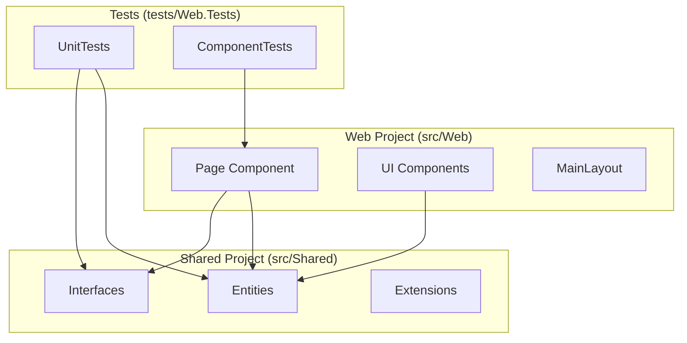

# [Feature Name] Design Document

## Overview

[Brief description of the feature and how it integrates with the existing Agent Toolkit architecture. Reference requirements from `requirements.md`.]

## Architecture

### Component Architecture



### Technology Choices

- **Rendering**: [Static SSR / Interactive Server — justify if interactive]
- **State**: [Component parameters / cascading values / service injection]
- **Data**: [In-memory / file-based / database — specify if needed]
- **Navigation**: [Route parameters / query strings]

## Components and Interfaces

### Domain Entities (`src/Shared/Entities/`)

```csharp
namespace Shared.Entities;

public class [EntityName]
{
    public int Id { get; set; }
    // Define properties
}
```

### Service Interfaces (`src/Shared/Interfaces/`)

```csharp
namespace Shared.Interfaces;

public interface I[ServiceName]
{
    Task<IReadOnlyList<[Entity]>> GetAllAsync();
    Task<[Entity]?> GetByIdAsync(int id);
}
```

### Service Registration (`src/Shared/Extensions/`)

```csharp
// Add to ServiceCollectionExtensions.AddSharedServices()
services.AddScoped<I[ServiceName], [ServiceName]>();
```

### Page Components (`src/Web/Components/Pages/`)

```razor
@page "/[route]"

<PageTitle>[Title]</PageTitle>

<div class="container mx-auto px-4">
    @* Component markup using Tailwind CSS *@
</div>

@code {
    // Component logic
}
```

## Data Models

### Entity Relationships

```mermaid
erDiagram
    [ENTITY_A] ||--o{ [ENTITY_B] : contains
    [ENTITY_A] {
        int Id
        string Name
    }
    [ENTITY_B] {
        int Id
        int EntityAId
    }
```

## Error Handling

- **Null data**: Show loading state (`@if (data is null)`) then empty-state message
- **Invalid routes**: Handled by existing `NotFound.razor` (status code 404)
- **Service failures**: Log via `ILogger<T>`, display user-friendly error message

## Testing Strategy

### Unit Tests (`tests/Web.Tests/UnitTests/`)

```csharp
public class [ServiceName]Tests
{
    [Fact]
    public async Task GetAllAsync_ReturnsAllItems()
    {
        // Arrange → Act → Assert
    }
}
```

### Component Tests (`tests/Web.Tests/ComponentTests/`)

```csharp
public class [PageName]Tests : TestContext
{
    [Fact]
    public void Renders_PageTitle()
    {
        var cut = RenderComponent<[PageName]>();
        cut.Find("title").TextContent.Should().Contain("[Expected Title]");
    }
}
```

### Test Coverage Goals
- **Unit tests**: All service methods and entity logic
- **Component tests**: Page rendering, parameter binding, user interactions
- **Build validation**: `dotnet build` passes with zero warnings

---

**Requirements Traceability**: This design addresses requirements from `requirements.md`
**Document Status**: Draft
**Last Updated**: [Date]
**Approval**: [ ] Approved — proceed to Tasks phase
